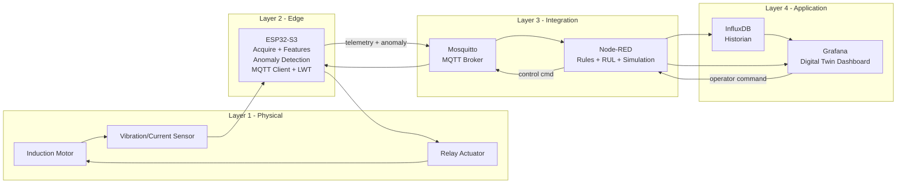

# e20-CO326 Motor Health Monitoring — Digital Twin with Edge Anomaly Detection

## Project Overview

This project implements an **Industrial IoT Digital Twin** for motor health monitoring using a 4-layer edge-to-cloud architecture. It follows the CO326 Course Project specification for Industrial Digital Twin & Cyber-Physical Security.

**Industrial Problem:** Detect early-stage motor bearing failure, imbalance, or abnormal behavior using edge-level anomaly detection and cloud-based RUL estimation.

**Stack:**
| Layer | Technology |
|---|---|
| Edge Device | ESP32-S3 (firmware — pending) |
| Message Broker | Eclipse Mosquitto (MQTT + Sparkplug B) |
| Flow Logic | Node-RED |
| Historian | InfluxDB 2.7 |
| Visualization / Digital Twin | Grafana |
| Infrastructure | Docker + Docker Compose |

---

## What Has Been Done (by @janith — Day 1)

- ✅ Repository structure initialized with all folders and `.gitkeep` placeholders
- ✅ Docker Compose stack configured with all 4 services (Mosquitto, Node-RED, InfluxDB, Grafana)
- ✅ Mosquitto broker running with password authentication (no anonymous access)
- ✅ Unified Namespace (UNS) topic hierarchy defined
- ✅ Node-RED ingestion flow built and deployed:
  - MQTT In → JSON Parse → Alarm Logic (Function) → InfluxDB Write + Debug
- ✅ InfluxDB `motor_health` bucket initialized and receiving data
- ✅ Grafana connected to InfluxDB via auto-provisioned data source
- ✅ Grafana dashboard exported and committed — `Motor Health Dashboard` with live RMS panel
- ✅ End-to-end pipeline tested with mock MQTT data
- ✅ `.env.example` created — secrets shared separately via WhatsApp
- ✅ Node-RED flow exported to `nodered/flows.json`
- ✅ Grafana dashboard exported to `grafana/dashboards/motor-health-dashboard.json`
- ✅ Grafana InfluxDB data source auto-provisioned via `grafana/provisioning/datasources/influxdb.yml`

---

## Repository Structure

```
e20-co326-Motor-Health-Monitoring-Digital-Twin-with-Edge-Anomaly-Detection/
├── docker/
│   ├── docker-compose.yml              ← All 4 services definition
│   ├── config/
│   │   ├── mosquitto.conf              ← Active Mosquitto config (committed)
│   │   └── passwd                      ← Broker auth (auto-generated, NOT in git)
│   ├── .env.example                    ← Template — copy to .env and fill in secrets
│   └── mock_publisher.py               ← Python script to simulate ESP32 telemetry
├── nodered/
│   └── flows.json                      ← Node-RED flow export (import this)
├── firmware/
│   ├── src/                            ← ESP32 Arduino/PlatformIO source (pending)
│   └── include/                        ← Header files (pending)
├── grafana/
│   ├── dashboards/
│   │   └── motor-health-dashboard.json ← Grafana dashboard export (auto-loaded)
│   └── provisioning/
│       └── datasources/
│           └── influxdb.yml            ← Auto-connects Grafana to InfluxDB on startup
├── docs/
│   ├── diagrams/                       ← Architecture diagrams (Mermaid)
│   └── evidence/                       ← Screenshots and test logs
└── README.md
```

---

## Prerequisites

- Docker Engine 24+ and Docker Compose Plugin
- Python 3.8+ with `paho-mqtt` (for mock publisher only)
- `mosquitto-clients` (for CLI testing)
- A browser (for Node-RED, InfluxDB, Grafana)

---

## Setup Instructions

### 1. Clone the repository

```bash
git clone https://github.com/cepdnaclk/e20-co326-Motor-Health-Monitoring-Digital-Twin-with-Edge-Anomaly-Detection.git
cd e20-co326-Motor-Health-Monitoring-Digital-Twin-with-Edge-Anomaly-Detection
```

### 2. Create your `.env` file

```bash
cp docker/.env.example docker/.env
```

Open `docker/.env` and fill in the credentials shared on WhatsApp. **Never commit the `.env` file.**

### 3. Regenerate the Mosquitto password file

The `passwd` file is not in git — each member generates it locally.

```bash
cd docker

docker run --rm -v "$(pwd)/config:/mosquitto/config" eclipse-mosquitto:2 \
  mosquitto_passwd -c -b /mosquitto/config/passwd motoradmin YOUR_MQTT_PASSWORD

# Verify it was created
ls config/
# Should show: mosquitto.conf  passwd
```

Replace `YOUR_MQTT_PASSWORD` with the MQTT password from WhatsApp.

> **Note (Kali/NTFS users):** You may see a `world readable permissions` warning — this is harmless on NTFS filesystems. The broker will still load the file correctly.

### 4. Start the full stack

```bash
cd docker
docker compose up -d
docker compose ps
```

Expected output — all 4 containers `Up`:
```
NAME        STATUS          PORTS
grafana     Up              0.0.0.0:3000->3000/tcp
influxdb    Up              0.0.0.0:8086->8086/tcp
mosquitto   Up              0.0.0.0:1883->1883/tcp, 0.0.0.0:9001->9001/tcp
nodered     Up (healthy)    0.0.0.0:1880->1880/tcp
```

### 5. Fix Docker DNS (Kali Linux only)

If image pulls fail with a DNS error:

```bash
sudo nano /etc/docker/daemon.json
```

Add:
```json
{
  "dns": ["8.8.8.8", "1.1.1.1"]
}
```

```bash
sudo systemctl restart docker
```

### 6. Import the Node-RED flow

1. Open `http://localhost:1880`
2. Click hamburger menu (top right) → **Import**
3. Select **Upload file** → choose `nodered/flows.json`
4. Click **Import** → **Deploy**

> **Important:** After import, verify two settings before deploying:
> - MQTT In node → Server Host = `mosquitto` (not `localhost`)
> - InfluxDB Out node → URL = `http://influxdb:8086` (not `localhost`)
>
> These must be Docker service names, not localhost, because Node-RED runs inside Docker.

### 7. Grafana — data source and dashboard (auto-provisioned)

The data source and dashboard are **automatically loaded** on first startup via provisioning files committed to the repo. No manual setup needed.

Verify:
1. Open `http://localhost:3000` → log in with credentials from `.env`
2. Go to **Connections → Data Sources** → InfluxDB should show a green ✅ tick
3. Go to **Dashboards** → open **Motor Health Dashboard**

> **If the data source shows an error:** The `INFLUX_TOKEN` in your `.env` must exactly match the token InfluxDB was initialized with. If you are setting up fresh, the token in `.env` is used automatically. If InfluxDB already has data from a previous run (existing volume), the token must match what was set originally.

### 8. Verify end-to-end with mock data

```bash
# Install dependency
pip install paho-mqtt

# Run mock publisher (simulates ESP32 telemetry)
python3 docker/mock_publisher.py
```

Then check:
- Node-RED debug panel shows incoming messages with `alarm_state` field
- InfluxDB Data Explorer → `motor_health` → `motor_features` → `rms` shows values
- Grafana Motor Health Dashboard shows live graph updating

---

## Service URLs

| Service | URL | Notes |
|---|---|---|
| Node-RED | http://localhost:1880 | No login required by default |
| InfluxDB | http://localhost:8086 | Credentials in `.env` |
| Grafana | http://localhost:3000 | Credentials in `.env` |
| MQTT Broker | localhost:1883 | Auth required — use credentials from `.env` |
| MQTT WebSocket | localhost:9001 | For browser-based MQTT clients |

---

## Unified Namespace (MQTT Topic Hierarchy)

```
factoryA/
└── area1/
    └── motor01/
        ├── telemetry/
        │   ├── raw             ← Raw sensor values (ESP32)
        │   ├── features        ← Extracted features + anomaly score
        │   └── anomaly         ← Anomaly flag and score only
        ├── state/
        │   ├── device          ← Heartbeat, WiFi, uptime
        │   └── relay           ← Current relay state
        ├── cmd/
        │   └── relay           ← Control commands from dashboard
        └── sim/
            └── mode            ← Simulation mode toggle
```

**Sparkplug B namespace (for formal compliance):**
```
spBv1.0/factoryA/DDATA/area1/motor01
```

---

## MQTT Payload Schema

All telemetry messages on `telemetry/features` use this JSON structure:

```json
{
  "ts": 1712566800,
  "motor_id": "motor01",
  "rms": 0.42,
  "peak": 0.71,
  "variance": 0.03,
  "anomaly_score": 0.12,
  "anomaly_flag": 0,
  "relay_state": 1,
  "mode": "live",
  "wifi_rssi": -55
}
```

| Field | Type | Description |
|---|---|---|
| `ts` | int | Unix timestamp (seconds) |
| `motor_id` | string | Device identifier |
| `rms` | float | Root mean square of sensor signal |
| `peak` | float | Peak signal value in window |
| `variance` | float | Signal variance in window |
| `anomaly_score` | float | 0.0 (normal) to 1.0 (critical) |
| `anomaly_flag` | int | 0 = normal, 1 = anomaly detected |
| `relay_state` | int | 0 = open, 1 = closed |
| `mode` | string | `live` or `simulation` |
| `wifi_rssi` | int | WiFi signal strength (dBm) |

---

## Node-RED Flow Description

The current flow (`nodered/flows.json`) implements:

1. **MQTT In** — subscribes to `factoryA/area1/motor01/telemetry/features`
2. **JSON Parse** — converts raw MQTT string payload to JavaScript object
3. **Alarm Logic** (Function node) — adds `alarm_state` field:
   - `anomaly_flag === 1` → `"ALARM"`
   - `anomaly_score > 0.5` → `"WARNING"`
   - Otherwise → `"NORMAL"`
4. **InfluxDB Out** — writes to `motor_features` measurement in `motor_health` bucket
5. **Debug** — prints all messages to the Node-RED debug panel

> **After every change to the Node-RED flow:** Export it immediately via hamburger menu → Export → All Flows → Download, then copy to `nodered/flows.json` and commit.

---

## Grafana Dashboard

The dashboard (`grafana/dashboards/motor-health-dashboard.json`) is auto-loaded on startup.

Current panels:
- ✅ Live RMS time-series graph

Planned panels (Member 3):
- Anomaly score gauge
- Alarm state indicator
- Relay state panel
- Device heartbeat panel
- Historical trend panel
- RUL estimate panel
- Relay control button (bidirectional twin control)

> **After every change to a Grafana dashboard:** Export it via Share → Export → Save to file, then copy to `grafana/dashboards/` and commit.

---

## Grafana Auto-Provisioning

The file `grafana/provisioning/datasources/influxdb.yml` tells Grafana to automatically connect to InfluxDB on startup using the `INFLUX_TOKEN` from your `.env`. This means teammates do **not** need to manually add the data source — it appears automatically when the container starts.

The `docker-compose.yml` mounts this folder:
```yaml
grafana:
  volumes:
    - grafana_data:/var/lib/grafana
    - ../grafana/provisioning:/etc/grafana/provisioning
```

---

## Data Persistence

Docker named volumes store all data:

| Volume | Contains | Survives `docker compose down`? |
|---|---|---|
| `docker_influxdb_data` | All time-series data, token, bucket | ✅ Yes |
| `docker_grafana_data` | Dashboard state, user settings | ✅ Yes |
| `docker_nodered_data` | Deployed flows | ✅ Yes |
| `docker_mosquitto_data` | Broker persistence | ✅ Yes |

> ⚠️ Running `docker compose down -v` will **delete all volumes and all data**. Only use this for a complete fresh start.

---

## What Needs to Be Done Next

### Member 1 — ESP32-S3 Firmware
- [ ] Set up PlatformIO project in `firmware/`
- [ ] Implement Wi-Fi connect and reconnect logic
- [ ] Implement MQTT connect, reconnect, and Last Will & Testament
- [ ] Read sensor (vibration or current)
- [ ] Compute features: RMS, peak, variance
- [ ] Implement edge anomaly detection (threshold or z-score)
- [ ] Publish telemetry to `factoryA/area1/motor01/telemetry/features`
- [ ] Subscribe to `factoryA/area1/motor01/cmd/relay` for control commands
- [ ] Drive relay output based on command

### Member 2 — Node-RED + MQTT
- [ ] Add heartbeat/LWT topic subscription and processing
- [ ] Add relay command validation and routing flow
- [ ] Implement simple RUL estimation (rolling trend of anomaly score)
- [ ] Add simulation mode toggle flow
- [ ] Export updated `flows.json` and commit

### Member 3 — Grafana Dashboard
- [ ] Build remaining Motor Health Dashboard panels (see list above)
- [ ] Add relay control button (Grafana → Node-RED → ESP32)
- [ ] Export updated dashboard JSON to `grafana/dashboards/` and commit

### Member 4 — Documentation & Hardware
- [ ] Draw electrical wiring diagram (ESP32 + sensor + relay)
- [ ] Draw simplified P&ID
- [ ] Write cybersecurity design summary
- [ ] Write reliability features summary
- [ ] Capture test evidence (screenshots, logs, photos)
- [ ] Start final report structure

---

## Architecture



---

## Security Notes

- Mosquitto requires username/password — anonymous access is disabled
- All credentials are in `.env` — never commit this file
- `.env` is listed in `.gitignore`
- Use `.env.example` as the safe template
- Credentials shared via WhatsApp only — never in chat, email, or commit messages
- All Docker services use non-default passwords
- `docker/config/passwd` is also in `.gitignore` — never commit the password hash

---

## Troubleshooting

| Problem | Cause | Fix |
|---|---|---|
| Mosquitto restarting | `passwd` file missing | Regenerate passwd file (Step 3) |
| Node-RED `connecting` | Wrong MQTT host | Set host to `mosquitto` not `localhost` |
| InfluxDB `ECONNREFUSED` in Node-RED | Wrong URL | Set URL to `http://influxdb:8086` |
| Grafana data source error | Token mismatch | Ensure `INFLUX_TOKEN` in `.env` matches InfluxDB init token |
| Docker DNS failure | IPv6 DNS on Kali | Add `8.8.8.8` to `/etc/docker/daemon.json` |
| `sed` permission error | Project on NTFS `/mnt/` | Edit config files manually in VS Code |
| Empty Data Explorer | No data written yet | Run mock publisher or send test MQTT message |
| `docker run` fails with spaces in path | Path has spaces | Always quote: `"$(pwd)/config:/mosquitto/config"` |
| Node-RED flow lost after reimport | Nodes show `connecting` | Re-set MQTT host and InfluxDB URL after every import |

---

## Team

| Member | Role |
|---|---|
| Janith | Infrastructure, Docker, MQTT, Node-RED, InfluxDB, Grafana setup |
| Member 2 | Node-RED flows, MQTT topic design, RUL logic |
| Member 3 | Grafana dashboard, Digital Twin UI |
| Member 4 | ESP32 firmware, sensor, relay, wiring |

---

*CO326 — Computer Systems Engineering & Industrial Networks | University of Peradeniya | 2026*